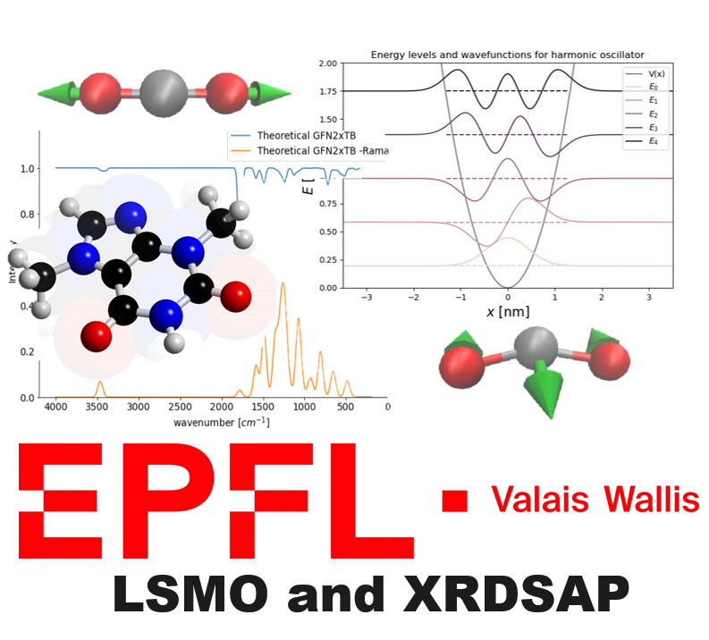

# PyLab - Infrared and Raman spectra learning

This repository contains the different applications with the aim of learning the basics of IR and Raman spectra by means of using interactive visualizations.

You can use this set of notebooks by installing an environment or running them on noto.epfl

All the logistical details for the environment creationg are stated below.

## Conda Environment
We have prepared a conda environment, named `pyIR-Raman`, with all the Python packages that you might need to run the notebooks. You can install it with the following command:   
`conda env create -f pyIR-Raman_crossplatform.yml`

Once installed, to activate the environment, please use `conda activate pyIR-Raman`. To use it in Jupyter, please initiate Jupyter from a terminal with pyIR-Raman as the active conda environment. Alternatively, you can add the conda environment as a custom kernel by using the following command:   
`python -m ipykernel install --user --name=pyIR-Raman`

*Note-1: You are of course welcome to install any additional package to the aforementioned conda environment.*   
*Note-2: The aforementioned setup has already been tested by the IR-Raman technical staff on Mac OS Sonoma 14.0, Ubuntu 22.04, and Windows 10.*

## Dry-run Instructions

Complete the following steps for a smooth exam experience:
1. Set up the `pyIR-Raman` [conda environment](#Conda-Environment).
2. Execute all the cells of `test_dryrun.ipynb` in Jupyter with `pyIR-Raman` as the active conda environment. On successful execution, it should print **'Package import test successful!'** without throwing any errors.

